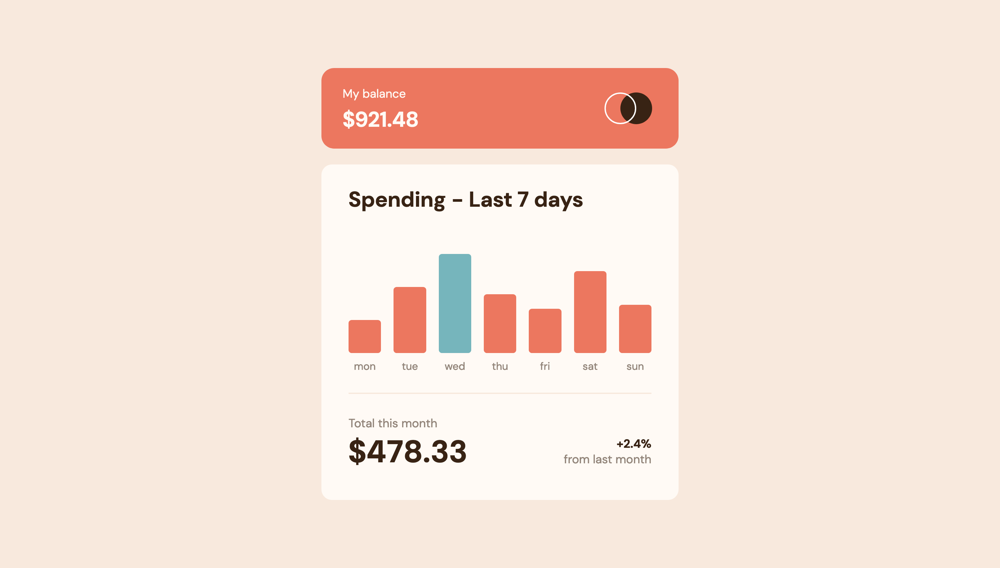

# Frontend Mentor - Expenses chart component solution

This is a solution to the [Expenses chart component challenge on Frontend Mentor](https://www.frontendmentor.io/challenges/expenses-chart-component-e7yJBUdjwt). Frontend Mentor challenges help you improve your coding skills by building realistic projects. 

## Table of contents

- [Overview](#overview)
  - [The challenge](#the-challenge)
  - [Screenshot](#screenshot)
  - [Links](#links)
- [My process](#my-process)
  - [Built with](#built-with)
  - [Continued development](#continued-development)
  - [Useful resources](#useful-resources)
- [Author](#author)
- [Acknowledgments](#acknowledgments)

## Overview

### The challenge

Users should be able to:

- View the bar chart and hover over the individual bars to see the correct amounts for each day
- See the current day’s bar highlighted in a different colour to the other bars
- View the optimal layout for the content depending on their device’s screen size
- See hover states for all interactive elements on the page
- **Bonus**: Use the JSON data file provided to dynamically size the bars on the chart

### Screenshot

### Links

- Solution URL: [Github repo here](https:/github.com/nicholasboyce/expenses-chart-component)
- Live Site URL: [Github pages here](https://nicholasboyce.github.io/expenses-chart-component)

## My process

### Built with

- Semantic HTML5 markup
- CSS custom properties
- Flexbox
- CSS Grid
- CSS CLAMP!! So much CLAMP, not a SINGLE MEDIA QUERY!

Even if it's not perfect, it's closer than I've ever gotten on something of this level.

### Continued development

I'm going to keep on using clamp when I can, and using the tools I have available to me to make the process of translating design into product easier! This was the nicest time I've had in a while building an exercise.

### Useful resources

- [Clamp calculator](https://www.marcbacon.com/tools/clamp-calculator/m) - This helped me get my clamps down! It's not very intuitive for me to create the formulas by hand so this was greatly appreciated.

## Author

- Frontend Mentor - [@nicholasboyce](https://www.frontendmentor.io/profile/nicholasboyce)

## Acknowledgments

Doing my best to strive for closer results to the design. Thanks to Cheosphere for showing me such progress is possible ^_^
